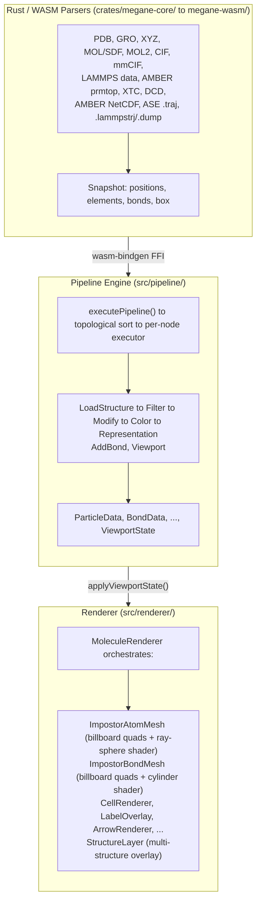

Developer guide to megane's internal architecture: how molecular data flows from file parsing to pixels on screen, and how to extend the system.

## Design Philosophy

megane's visual pipeline is built on three core principles:

### Typed Data Flow

The pipeline is a directed acyclic graph where edges carry one of **9 typed data channels**: `particle`, `bond`, `cell`, `trajectory`, `label`, `mesh`, `vector`, `volumetric`, and `spectrum`. Nodes declare typed input/output ports via `NODE_PORTS` in `src/pipeline/types.ts`. The UI prevents connections between incompatible port types at the graph level (see `canConnect()`), so executors can trust that incoming data has the expected shape.

### Separation of Computation and Rendering

Pipeline execution produces a pure data structure — `ViewportState` — with no Three.js dependencies. A separate translation layer (`applyViewportState()` in `src/pipeline/apply.ts`) maps that data to renderer method calls. This means:
- The pipeline can be tested without a WebGL context.
- The renderer can be swapped without changing pipeline logic.
- Multiple front-ends (app, widget, docs embed) share the same pipeline engine.

### GPU-Efficient Impostor Rendering

Instead of mesh-based spheres (32+ triangles each), atoms are rendered as **screen-aligned quads** (2 triangles) with ray-sphere intersection in the fragment shader. The base per-atom data costs 7 floats of GPU memory (position xyz, radius, color rgb), and the current `ImpostorAtomMesh` implementation adds 2 more floats for per-atom scale and opacity overrides (9 floats/atom total). All atoms draw in a single instanced call. This is what allows megane to render 1M+ atoms at 60 fps on mid-range hardware.

## System Overview



## Pipeline Data Types

Nine typed channels flow through pipeline edges. Defined in `src/pipeline/types.ts`.

| Channel | Interface | Key Fields | Produced By | Consumed By |
|---------|-----------|------------|-------------|-------------|
| `particle` | `ParticleData` | `source` (Snapshot), `indices`, `scaleOverrides`, `opacityOverrides`, `colorOverrides`, `representationOverride` | LoadStructure, Streaming, Filter, Modify, Color, Representation | Filter, Modify, Color, Representation, AddBond, Labels, Polyhedra, Viewport |
| `bond` | `BondData` | `bondIndices`, `bondOrders`, `nBonds`, `scale`, `opacity` | AddBond, Streaming, Filter, Modify | Filter, Modify, Viewport |
| `cell` | `CellData` | `box` (3x3 Float32Array), `visible`, `axesVisible` | LoadStructure, Streaming | Viewport |
| `trajectory` | `TrajectoryData` | `provider` (FrameProvider), `meta` | LoadStructure, LoadTrajectory, Streaming | Viewport |
| `label` | `LabelData` | `labels[]`, `particleRef` | LabelGenerator | Viewport |
| `mesh` | `MeshData` | `positions`, `indices`, `normals`, `colors` | PolyhedronGenerator, SurfaceMesh, Isosurface | Viewport |
| `vector` | `VectorData` | `frames` (VectorFrame[]), `scale` | LoadVector, VectorOverlay | VectorOverlay, Viewport |
| `volumetric` | `VolumetricData` | `nx`, `ny`, `nz`, `origin`, `step`, `data` | LoadVolumetric | Isosurface |
| `spectrum` | `SpectrumData` | `title`, `dataType`, `xUnits`, `yUnits`, `x`, `y` | LoadSpectrum | SpectrumPlot |

Each edge in the UI is color-coded by data type (`DATA_TYPE_COLORS`). Filter and Modify nodes are generic — they accept both `particle` and `bond` inputs via `GENERIC_NODE_ACCEPTS`. The Color and Representation nodes are particle-only modifiers that share the same Modify category in the toolbar (Ovito-style stack: each modifier owns one visual property — Modify = scale & opacity, Color = per-atom palette, Representation = atoms/licorice/cartoon/both/surface/line/illustrative).

## Pipeline Execution

`executePipeline()` in `src/pipeline/execute.ts` drives the data flow:

1. **Topological sort** — `topologicalSort()` (Kahn's algorithm) in `src/pipeline/graph.ts` determines execution order.
2. **Per-node dispatch** — A switch on `params.type` calls the appropriate executor from `src/pipeline/executors/`.
3. **Edge data propagation** — An `EdgeOutputs` map (`Map<nodeId, Map<portName, PipelineData>>`) carries outputs between nodes. `collectInputs()` gathers upstream data for each node.
4. **Disabled node passthrough** — Disabled nodes forward their first input to a matching output port, preserving downstream flow.
5. **ViewportState assembly** — The `viewport` executor collects all 7 channels into a single `ViewportState`.
6. **Error collection** — `NodeError` objects (warning/error) accumulate per-node and are surfaced in the UI as badges.

## Rendering Layer

### MoleculeRenderer

`src/renderer/MoleculeRenderer.ts` (~1300 lines) is the main orchestrator. It owns the Three.js scene, camera (orthographic or perspective), OrbitControls, and all sub-renderers. Its API is imperative and framework-agnostic — React components call it via refs, and the widget/docs embed uses the same API.

Scene graph structure:

```
THREE.Scene
├── Lights (hemisphere + 3-point directional)
├── ImpostorAtomMesh.mesh      (primary structure atoms)
├── ImpostorBondMesh.mesh      (primary structure bonds)
├── CellRenderer               (wireframe simulation box)
├── CellAxesRenderer           (a, b, c axis arrows)
├── LabelOverlay               (Canvas 2D text on top)
├── ArrowRenderer              (per-atom vectors)
├── PolyhedronRenderer         (coordination polyhedra)
├── Selection highlights
├── PivotMarker                (rotation center crosshair)
└── StructureLayer[]           (one per additional structure)
    ├── ImpostorAtomMesh
    ├── ImpostorBondMesh
    └── CellRenderer
```

### Impostor Technique

`ImpostorAtomMesh` (`src/renderer/ImpostorAtomMesh.ts`) uses `InstancedBufferGeometry` with a single 4-vertex quad:

```
Vertex Shader                    Fragment Shader
─────────────                    ───────────────
For each instance:               For each fragment:
  Expand quad to screen-           Compute dist from center
  aligned billboard sized          If dist > 1.0 → discard
  by radius × scale                z = sqrt(1 - dist²)
                                   Write correct gl_FragDepth
                                   Apply lighting (dual diffuse
                                   + Blinn-Phong + Fresnel rim)
```

Instance attributes per atom:
- `instanceCenter` (vec3) — world position
- `instanceRadius` (float) — vdW radius × BALL_STICK_ATOM_SCALE
- `instanceColor` (vec3) — element color from CPK/VESTA scheme
- `instanceScaleOverride` (float) — per-atom scale multiplier (default 1.0)
- `instanceOpacityOverride` (float) — per-atom opacity multiplier (default 1.0)

Global scale and opacity are O(1) uniform updates. Per-atom overrides are activated via `uUsePerAtomOverrides` uniform. Buffers are pre-allocated to `maxAtoms` (default 1M) and grow dynamically if needed.

### Bond Rendering

`ImpostorBondMesh` (`src/renderer/ImpostorBondMesh.ts`) renders bonds as billboard quads stretched between atom pairs. Atom positions are stored in a **DataTexture** and read via `texelFetch()` in the vertex shader — this means per-frame position updates cost O(nAtoms) regardless of bond count.

Bond order visualization:
- **Single** — 1 cylinder
- **Double** — 2 parallel cylinders (perpendicular offset)
- **Triple** — 3 cylinders in triangular arrangement
- **Aromatic** — 1 solid + 1 dashed offset cylinder

Bond coloring is **split by endpoint**: each bond carries two per-instance colors (`instanceColorA`/`instanceColorB`), and the fragment shader picks one based on the sign of the cylinder's axial coordinate (`vCylUv.y`), so the half nearest each atom takes that atom's color (e.g. a C–H bond is half grey, half white). This matches the convention used by VMD/PyMOL/Mol*. The same split applies under every color scheme (by element/residue/chain/etc.) because the colors are derived from the per-atom color buffer.

Each cylinder runs from atom centre to atom centre, so its ends are buried inside the endpoint spheres. While the atoms are opaque the depth test hides that, but a transparent atom stops writing depth and the buried stick blends straight through the ball — the model then reads as beads threaded onto rods instead of one fused solid. The bond fragment shader therefore renders the **CSG union** of stick and balls: after the ray/cylinder hit is computed it discards any fragment lying inside either endpoint sphere, so the stick ends exactly on the ball's skin at any viewing angle and each pixel is covered by one surface instead of two. Because a buried point is always behind the sphere's own front face along the same ray, the trim discards precisely the fragments the depth test was already rejecting — opaque renders are pixel-identical, and transparent ones cost slightly *less* because the discarded fragments skip the lighting block.

The trim needs the radius of the ball actually on screen, which varies with the global atom scale, per-atom scale overrides and the licorice uniform radius. It rides in the otherwise-unused **alpha channel of the position DataTexture**, so the vertex shader gets it from the texel it already fetches — no extra attribute, texture or bandwidth. `ImpostorAtomMesh.setRadiusSink()` pushes the effective radii on every restyle (`MoleculeRenderer.swapRenderers` / `StructureLayer` wire it once) and `ImpostorBondMesh` mirrors them so they survive the per-frame topology rebuilds that distance-based bonding triggers. A radius of 0 — an atom hidden by a representation, or faded to fully transparent — disables the trim for that endpoint, so a stick with no ball stays whole. PBC ghost atoms, which live past the real-atom range and are drawn by a separate boundary renderer, fall back to the per-element ball-and-stick radius.

### Shader Architecture

All shaders are in `src/renderer/shaders.ts` as GLSL 3.0 ES strings, used with `RawShaderMaterial`. This requires explicit declaration of all uniforms and attributes (no Three.js auto-injection).

Lighting model:
- Dual directional diffuse (sky-blue key light + warm fill)
- Blinn-Phong specular highlights
- Fresnel rim lighting for depth cues
- Edge darkening for contour emphasis

### AtomRenderer / BondRenderer Interfaces

`src/types.ts` defines renderer abstraction interfaces:

```typescript
interface AtomRenderer {
  readonly mesh: THREE.Object3D;
  loadSnapshot(snapshot: Snapshot): void;
  updatePositions(positions: Float32Array): void;
  setScale?(scale: number, snapshot: Snapshot): void;
  setOpacity?(opacity: number): void;
  setScaleOverrides?(overrides: Float32Array): void;
  setOpacityOverrides?(overrides: Float32Array): void;
  clearOverrides?(): void;
  dispose(): void;
}
```

`ImpostorAtomMesh` is the default implementation. The legacy `AtomMesh` (InstancedMesh + SphereGeometry) also exists. The interface is the swap point for alternative renderers.

### Multi-Structure Overlay

`StructureLayer` (`src/renderer/StructureLayer.ts`) encapsulates an independent set of atom/bond/cell renderers per additional `load_structure` node. `applyViewportState()` routes the first particle source to the primary renderer and additional sources to their respective StructureLayers, keyed by `sourceNodeId`.

## Extending megane

### Adding a New Pipeline Node

The most common extension. The overview below lists the steps; for a complete,
copy-paste walkthrough (every touch-point, the rules, the base classes, and how
to test) see [Writing a Custom Pipeline Node](/dev/custom-nodes).

Here are the steps, using a hypothetical "ColorByProperty" node as an example:

**1. Define the node type** in `src/pipeline/types.ts`:
- Add `"color_by_property"` to the `PipelineNodeType` union
- Add a label in `NODE_TYPE_LABELS`
- Assign a category in `NODE_CATEGORY`

**2. Define parameters**:
```typescript
export interface ColorByPropertyParams {
  type: "color_by_property";
  property: "element" | "index" | "x" | "y" | "z";
  colormap: string;
}
```
Add to the `PipelineNodeParams` union and `defaultParams()` switch.

**3. Define ports** in `NODE_PORTS`:
```typescript
color_by_property: {
  inputs: [{ name: "particle", dataType: "particle", label: "Particle" }],
  outputs: [{ name: "particle", dataType: "particle", label: "Particle" }],
},
```

**4. Write the executor** in `src/pipeline/executors/colorByProperty.ts`:
```typescript
export function executeColorByProperty(
  params: ColorByPropertyParams,
  inputs: Map<string, PipelineData[]>,
): Map<string, PipelineData> {
  const particles = inputs.get("particle");
  if (!particles?.length) return new Map();
  const particle = particles[0] as ParticleData;
  // ... compute color overrides ...
  return new Map([["particle", { ...particle, /* modified fields */ }]]);
}
```
Follow existing patterns in `filter.ts` or `modify.ts`.

**5. Register in the execution engine** — Add a `case "color_by_property":` to the switch in `executePipeline()` (`src/pipeline/execute.ts`).

**6. Create the UI node** — Add `src/components/nodes/ColorByPropertyNode.tsx` wrapping `NodeShell` (`src/components/nodes/NodeShell.tsx`). Follow the pattern from `FilterNode.tsx` or `ModifyNode.tsx`.

**7. Register in the node palette** — Add to the node creation menu so users can drag it onto the canvas.

### Adding a New Renderer Backend

Implement the `AtomRenderer` or `BondRenderer` interface from `src/types.ts`:

- **Required**: `mesh` property, `loadSnapshot()`, `updatePositions()`, `dispose()`
- **Optional**: `setScale()`, `setOpacity()`, `setScaleOverrides()`, `setOpacityOverrides()`, `clearOverrides()`

Wire it into `MoleculeRenderer` by replacing the renderer construction. See `ImpostorAtomMesh` and the legacy `AtomMesh` (`src/renderer/AtomMesh.ts`) as reference implementations.

### Adding a New Data Channel Type

If the existing 8 channels don't cover your needs:

1. Add to `PipelineDataType` union and `DATA_TYPE_COLORS` in `src/pipeline/types.ts`
2. Create the data interface (e.g., `SurfaceData`)
3. Add to the `PipelineData` union
4. Add an input port to the viewport node's `NODE_PORTS` entry
5. Add a field to `ViewportState` and `DEFAULT_VIEWPORT_STATE`
6. Handle the new field in `applyViewportState()` (`src/pipeline/apply.ts`)
7. Implement the corresponding renderer

### Modifying Shaders

Shaders live in `src/renderer/shaders.ts` as template literal strings. Because `RawShaderMaterial` is used, you must declare all `uniform` and `in`/`out` variables explicitly.

To add a new uniform:
1. Declare it in the GLSL string (e.g., `uniform float uMyParam;`)
2. Add it to the `uniforms` object in the material constructor (in `ImpostorAtomMesh.ts` or `ImpostorBondMesh.ts`)
3. Set it from the renderer API: `this.material.uniforms.uMyParam.value = val`

### Adding a New File Format Parser

The single source of truth for cross-host format coverage is
`docs/docs/platform-support.md` — every parser change MUST update its tables in
the same PR. The full per-host registration checklist lives in the
`add-format` skill (`.claude/skills/add-format/SKILL.md`).

1. Implement the parser in Rust in `crates/megane-core/src/`
2. Expose via WASM in `crates/megane-wasm/src/lib.rs` with `#[wasm_bindgen]`
3. Expose via PyO3 in `crates/megane-python/src/lib.rs` with `#[pyfunction]`
4. Add the file-extension dispatch in `src/parsers/structure.ts`
   (`parseStructureFile`) and the standalone accept lists in
   `src/components/nodes/LoadStructureNode.tsx` /
   `LoadTrajectoryNode.tsx`
5. Register the type on every host: `jupyterlab-megane/src/filetypes.ts`
   (JupyterLab `IFileType`) and `vscode-megane/package.json`
   (VS Code `customEditors`)
6. Wire the Python `LoadStructure` / `LoadTrajectory` dispatch in
   `python/megane/pipeline.py` (`_load_structure_file` / `_load_trajectory_data`)
7. Update `docs/docs/platform-support.md`, `docs/docs/introduction.md`,
   `docs/docs/getting-started.md`, and `README.md`

## Key File Index

| Subsystem | Files |
|-----------|-------|
| **Core types** | `src/types.ts` (Snapshot, Frame, AtomRenderer, BondRenderer) |
| **Pipeline types** | `src/pipeline/types.ts` (data channels, ports, node params, ViewportState) |
| **Pipeline engine** | `src/pipeline/execute.ts`, `src/pipeline/graph.ts` |
| **Pipeline → Renderer** | `src/pipeline/apply.ts` |
| **Node executors** | `src/pipeline/executors/` (one file per node type) |
| **Selection DSL** | `src/pipeline/selection.ts` (recursive-descent parser/evaluator) |
| **Main renderer** | `src/renderer/MoleculeRenderer.ts` |
| **Atom impostor** | `src/renderer/ImpostorAtomMesh.ts` |
| **Bond impostor** | `src/renderer/ImpostorBondMesh.ts` |
| **Shaders** | `src/renderer/shaders.ts` |
| **Multi-structure** | `src/renderer/StructureLayer.ts` |
| **Camera/controls** | `src/renderer/CameraManager.ts` |
| **Picking** | `src/renderer/Picking.ts` |
| **Element data** | `src/constants.ts` (colors, vdW radii, bond params) |
| **WASM parsers** | `crates/megane-core/`, `crates/megane-wasm/` |
| **Python bindings** | `crates/megane-python/`, `python/megane/` |
| **Pipeline store** | `src/pipeline/store.ts` (Zustand) |
| **Binary protocol** | `src/protocol/protocol.ts` |
