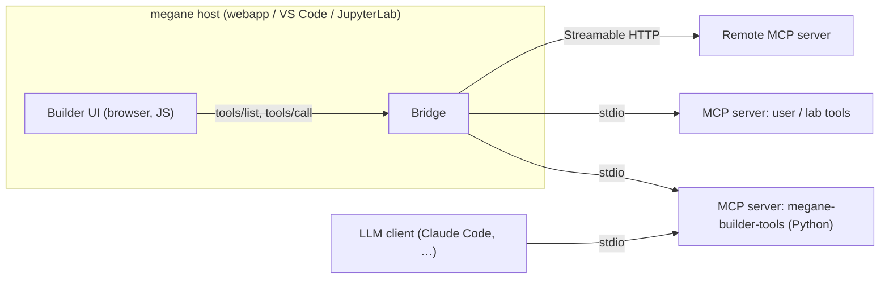

**Status: contract version 1.** Builder implements it over Streamable HTTP
(`src/builder/tools/`, the *Python tools* section of the sidebar); the
reference server is [megane-builder-tools](https://github.com/hodakamori/megane-builder-tools).
This page is the specification megane Builder and third-party structure tools
implement. Change
it here first, then change the code; cite the section in the PR.

megane Builder is a JavaScript application, while most structure-generation
software (packmol, ASE, pymatgen, RDKit, polymer builders, …) is Python.
Instead of porting that software to TypeScript, Builder exposes
**tool buttons** — *Liquid box*, *Polymer chain*, *Solvate*, … — whose work
runs in an [MCP](https://modelcontextprotocol.io/) server. Users add servers
and get new buttons without any change to megane.

MCP alone only says "a tool has a name and a JSON Schema". Turning a tool into
a Builder button additionally needs agreement on which tools are buttons, how
a molecule or an atom is passed in, what structure comes back, and how that
structure enters the document. This page is that agreement: a small profile on
top of MCP, identified by the `_meta` prefix `io.github.megane-labs/`.

The same server stays an ordinary MCP server, so LLM clients (Claude Code,
Claude Desktop, megane's own chat) can call the same tools. Everything below is
chosen so that a tool is fully usable by a client that knows nothing of this
contract.

## 1. Scope

In scope for contract version 1:

- **Coarse, stateless generators.** One call takes parameters (and, for some
  tools, a read-only copy of the open document) and returns atoms. Liquid and
  gas boxes, polymer chains, solvation, adsorbate placement, crystal builders
  that need a Python library.
- **Two ways a result enters the document** (§5): it becomes a new document,
  or its atoms are added to the open one.

Out of scope for version 1:

- Tools that move, delete or re-type atoms of the open document (geometry
  optimisation, protonation, charge assignment). They need a third apply mode
  that replaces the structure while keeping Builder's edit history
  meaningful; see §11.
- Interactive tools (anything needing more than one round trip with the user
  during a call). MCP elicitation is not used.
- Trajectories, volumetric data, force-field parameter files. A result is one
  structure.

## 2. Architecture



- **Builder** renders buttons and forms, calls tools, and applies results as
  ordinary Builder document changes (Undo works as usual). It stays the owner
  of the document; servers never hold document state.
- **Bridge** is host code that owns the MCP connections. A browser page cannot
  spawn processes, so every host needs one (§8). It is the only component that
  speaks MCP transports; Builder talks to it through a narrow message API.
- **Servers** are ordinary MCP servers. megane ships a reference server,
  `megane-builder-tools`, in a separate repository (§10).

## 3. Discovery: which tools are buttons

A tool is a Builder button if and only if its `Tool` definition carries
`_meta["io.github.megane-labs/builder"]` with a `contract` Builder supports.
Other tools of the same server are ignored by Builder (LLM clients still see
them).

```json
{
  "name": "liquid_box",
  "title": "Liquid box",
  "description": "Fill a periodic box with molecules at a target density using packmol. …",
  "icons": [{ "src": "data:image/svg+xml;base64,…", "mimeType": "image/svg+xml", "sizes": ["any"] }],
  "inputSchema": { "…": "§4" },
  "outputSchema": { "$ref": "…BuilderResult, inlined, see §5" },
  "annotations": { "readOnlyHint": true, "openWorldHint": false },
  "_meta": {
    "io.github.megane-labs/builder": {
      "contract": 1,
      "category": "bulk",
      "apply": "new_document",
      "document": "none",
      "stochastic": true,
      "expectedSeconds": 20
    }
  }
}
```

| Field | Type | Meaning |
| --- | --- | --- |
| `contract` | integer | Contract version. Builder hides tools whose version it does not support and says so once per server. |
| `category` | `"bulk"` \| `"molecule"` \| `"polymer"` \| `"surface"` \| `"solvation"` \| `"other"` | Sidebar group the button is placed in. |
| `apply` | `"new_document"` \| `"insert"` | How the result enters the document (§5). |
| `document` | `"none"` \| `"optional"` \| `"required"` | Whether the tool receives the open document (§4.3). `insert` tools usually say `required`. |
| `stochastic` | boolean | The result depends on a random seed. Such a tool **must** have a `seed` input (§4.4). |
| `expectedSeconds` | number, optional | Typical run time; Builder shows a progress bar instead of a spinner above ~2 s and uses it to pick a timeout (§6). |

Everything a user reads comes from standard MCP fields: `title` is the button
label (fallback: `name`), the first sentence of `description` is its tooltip,
and `icons` is its icon. Builder renders only `data:` icons; any other icon
source falls back to the category icon (this sidesteps the icon-fetching rules
in the MCP spec). `description` is written for both humans and LLMs: first
sentence for the tooltip, the rest for the model.

Tool names should be unique within a server; Builder always addresses a tool as
(server id from the user's configuration, tool name), so two servers may both
have `liquid_box`.

## 4. Inputs

`inputSchema` is a normal JSON Schema 2020-12 object schema. Builder generates
the tool's form from it. Two things are added:

1. Per-property annotations `x-megane-widget` and `x-megane-unit` (JSON Schema
   ignores unknown `x-` keywords, and MCP already uses the same convention for
   `x-mcp-header`). They only choose the form control. **The property's schema
   itself is always the real wire format**, so a client without the contract —
   an LLM — can still fill it in.
2. A set of shared value types (§4.2) that the widgets produce.

### 4.1 Form generation

Builder supports this subset of JSON Schema for form generation. A tool that
needs more must still validate on the server, but Builder shows it with a
"cannot build a form" notice instead of a button:

| Schema | Control |
| --- | --- |
| `type: "number"` / `"integer"`, with `minimum`, `maximum`, `exclusiveMinimum`, `exclusiveMaximum`, `multipleOf` | Number field (with unit suffix from `x-megane-unit`) |
| `type: "string"` with `enum` | Select |
| `type: "string"` | Text field (`maxLength` respected) |
| `type: "boolean"` | Checkbox |
| `type: "array"` of numbers with `minItems == maxItems ≤ 9` | Fixed-size vector field |
| `type: "array"` of objects | Editable table, one row per item; columns from the item schema |
| `type: "object"` (one level of nesting) | Fieldset |
| Any property with `x-megane-widget` | The widget in §4.2 |

`title` labels the control, `description` becomes its help text, `default`
pre-fills it, `required` marks it mandatory. `oneOf` / `anyOf` / `if` / `$ref`
to external URIs are not supported for form generation (local `$ref` into
`$defs` is). A property with a widget is exempt: its control comes from the
widget, not from its schema.

Every required property without a `default` **should** carry JSON Schema
`examples`. The conformance checker (§10) calls each tool with the first
example (else the default, else a generic value) of every property, and LLM
clients read them as hints. For `liquid_box` that is `"examples": [100]` on a
component's count; without it, the generic count of 1 builds a box too small
to pack and the check cannot run the tool.

### 4.2 Shared value types and widgets

The JSON Schemas below are normative. A server's property with a given
`x-megane-widget` **must** declare a schema that accepts exactly this shape
(it may be stricter, e.g. `minItems`). The reference SDK (§10) exports them.

**`x-megane-widget: "molecule"` — a molecule from the Builder library.**
The control is the library picker (presets, sketches, imported files). Builder
sends the library molecule as a V2000 mol block with explicit hydrogens and 3D
coordinates in Å — what the library already stores after RDKit embedding.

```json
{
  "type": "object",
  "properties": {
    "name": { "type": "string" },
    "molblock": { "type": "string", "description": "V2000 mol block, explicit H, 3D, Å" },
    "smiles": { "type": "string" }
  },
  "required": ["name"],
  "anyOf": [{ "required": ["molblock"] }, { "required": ["smiles"] }]
}
```

Builder always sends `molblock` (plus `smiles` when the library entry has
one). Servers **must** accept `molblock` and **may** accept `smiles` alone, which
is what LLM clients will usually send; a server that cannot embed a SMILES
returns a tool error saying so. A server **must not** re-embed or re-optimise a
3D `molblock` it was given: the user chose that conformer.

Whether a mol block is 3D is stated by the **dimension code** in its header
(columns 21–22 of the second line, `3D` or `2D`), never guessed from the
coordinates: a flat molecule is a valid 3D geometry (Builder's benzene preset
has z = 0 for every atom). Builder writes `3D` for library molecules and `2D`
for the ones marked planar (imported 2D files). Servers that need 3D input
return a tool error for a `2D` mol block rather than guessing a conformer, and
treat a missing code as 3D.

**`x-megane-widget: "atom"` — one atom of a molecule argument.** Used, for
example, for the head and tail atoms of a polymer monomer. The value is a
0-based index into the atom block of that molecule's `molblock`. The property
names the molecule argument it refers to with `x-megane-of`; the control shows
that molecule and lets the user click an atom.

```json
{ "type": "integer", "minimum": 0, "x-megane-widget": "atom", "x-megane-of": "monomer" }
```

**`x-megane-widget: "element"`** — an atomic number, `{"type": "integer",
"minimum": 1, "maximum": 118}`, shown as the periodic-table picker.

**`x-megane-widget: "cell"`** — a row-major 3×3 cell in Å, `{"type": "array",
"items": {"type": "number"}, "minItems": 9, "maxItems": 9}`. Builder pre-fills
it with the open document's cell when there is one, and offers the
orthorhombic `a, b, c` shortcut.

**`x-megane-widget: "selection"`** — atom indices into the `document` argument
(§4.3), `{"type": "array", "items": {"type": "integer", "minimum": 0}}`.
Builder fills it with the atoms selected in the 3D view.

**`x-megane-widget: "seed"`** — `{"type": "integer", "minimum": 0}`. Builder
pre-fills a fresh random value, shows it, and records it (§7).

**`x-megane-widget: "document"`** — see §4.3. Never shown as a control.

### 4.3 The open document

A tool whose `_meta` says `document: "required"` or `"optional"` declares
exactly one property with `x-megane-widget: "document"` and the
[`Structure`](#51-structure) schema. Builder fills it with the structure
currently shown in the 3D view (the document with its edits applied), never
the original file. `selection` indices refer to atoms of this payload.

The document is **read-only input**. An `insert` tool returns only the atoms it
adds, never the document's atoms (§5.2); this is what keeps the Builder's edit
history, atom references and Undo valid across a tool call.

### 4.4 Units and conventions

Values are always in the canonical unit; `x-megane-unit` is only the label and
the conversion the control offers. The canonical units are:

| `x-megane-unit` | Quantity | Canonical unit |
| --- | --- | --- |
| `angstrom` | length | Å |
| `degree` | angle | ° |
| `g/cm3` | density | g cm⁻³ |
| `kelvin` | temperature | K |
| `count` | number of molecules / repeat units | 1 |

Anything else (e.g. `mol/L`) is displayed verbatim and not converted.

Every `stochastic` tool declares a `seed` property. Given the same arguments,
the same seed and the same server and library versions, a tool **should**
return the same structure.

## 5. Results

A successful call returns `structuredContent` conforming to `BuilderResult`,
declares that schema as its `outputSchema`, and, per the MCP spec, also returns
a short text summary in `content` (for LLM clients, e.g. *"Built a 3.1 nm box
with 1000 water and 20 ethanol molecules (3160 atoms)."*).

```json
{
  "contract": 1,
  "name": "water-ethanol",
  "structure": { "…": "Structure, §5.1" },
  "warnings": ["packmol reached the iteration limit; minimum distance 1.7 Å < tolerance 2.0 Å"],
  "provenance": {
    "software": { "packmol": "20.15.1", "rdkit": "2026.03.6" },
    "seed": 12345
  }
}
```

| Field | Meaning |
| --- | --- |
| `contract` | Must equal the tool's `contract`. |
| `name` | Suggested document / fragment name. Builder sanitises it and uses it as the file name for `new_document`. |
| `structure` | The atoms (§5.1). |
| `warnings` | Non-fatal problems, shown in Builder's notice line. A result that is unusable is an error (§6), not a warning. |
| `provenance` | Versions of the software that produced the result and the seed actually used. Free-form object of strings / numbers; recorded by Builder (§7). |

### 5.1 Structure

The payload is a structure-of-arrays JSON object that maps directly onto
megane's `Snapshot` and on to the fields the writers export. It is used both
for results and for the `document` input.

| Field | Type | Required | Notes |
| --- | --- | --- | --- |
| `elements` | integer[] | yes | Atomic numbers, length N. `0` is not allowed. |
| `positions` | number[] | yes | Cartesian Å, flat `[x0,y0,z0, x1,…]`, length 3N. |
| `cell` | number[9] \| null | yes | Row-major lattice vectors in Å, or `null` for a non-periodic structure. |
| `bonds` | [int, int][] | yes | 0-based atom index pairs. **Complete**: every bond the tool knows. |
| `bondOrders` | integer[] | no | Parallel to `bonds`: 1, 2, 3, or 4 (aromatic). Omitted means all single. |
| `molecules` | integer[] | no | Per-atom 0-based molecule index. |
| `residueNames` | string[] | no | Per-atom residue name (≤ 4 chars recommended for PDB export). |
| `residueIds` | integer[] | no | Per-atom residue number. |
| `atomNames` | string[] | no | Per-atom name. |
| `chainIds` | string[] | no | Per-atom single-character chain id. |
| `formalCharges` | integer[] | no | Per-atom formal charge. |
| `scalars` | object of number[] | no | Named per-atom channels megane does not render yet (e.g. `"partial_charge"`). Kept, not dropped. |

Rules:

- All per-atom arrays have length N; mismatched lengths make the result
  invalid.
- **Builder draws exactly the bonds the payload lists and infers none.** A
  tool that builds molecules must return their bonds; a tool that genuinely
  has no connectivity (e.g. an atomic gas) returns `[]`. This is the same
  "the source asserts, nothing is invented" principle megane's parsers follow
  (rule #11 in `AGENTS.md`).
- Molecules should be returned whole (not wrapped into the cell); Builder's
  *Wrap* op does wrapping when the user wants it.
- Size: Builder accepts up to 500 000 atoms per result. Tools that can exceed
  this should expose a limit parameter. A binary encoding for large payloads is
  reserved for a later contract version.

### 5.2 Apply modes

| `apply` | What Builder does | Undo |
| --- | --- | --- |
| `new_document` | Asks for confirmation if the open document has edits, then opens the result as a new document (`openStructure`), named from `name`. Residue names become the document's labels. | The previous document is replaced, like *File → New*. |
| `insert` | Converts the result into **one `add_fragment` op** (absolute positions, no translation, bonds and orders from the payload) with a fresh fragment id, and pushes it. If the result's `cell` differs from the document's, a `set_cell` op (without atom scaling) is pushed first, in the same step. The new atoms are selected. | One Undo removes the whole insertion. |

Because `insert` goes through the existing `add_fragment` op, a tool-inserted
molecule is indistinguishable from a library placement: later edits address it
as `<fragmentId>:<k>`, and the document replays without the server.

## 6. Execution, errors, cancellation

- Builder calls a tool only on an explicit user action (button → form →
  *Run*). It never calls tools on its own.
- Builder validates arguments against `inputSchema` before calling, and
  validates `structuredContent` against **its own** copy of `BuilderResult`
  (not the server-provided `outputSchema`) before applying anything.
- Calls carry a `progressToken`. Servers **should** send
  `notifications/progress` for anything longer than a couple of seconds; the
  `message` is shown under the progress bar.
- *Cancel* sends `notifications/cancelled`. Servers **should** stop the
  external process (packmol, …) promptly. Builder discards any result that
  arrives after cancellation.
- Timeout: `max(60 s, 5 × expectedSeconds)`, and at most 30 minutes. Hitting it
  behaves like *Cancel* and reports a timeout.
- A stdio server writes nothing but MCP messages to stdout. Libraries that
  print (RadonPy does) must be silenced or redirected to stderr, or the
  bridge loses the connection.
- Failures a user can fix (invalid combination of parameters, packmol did not
  converge, a planar molecule where 3D is required) are **tool errors**:
  `isError: true` with a one-line, actionable message in the first text content
  item. Builder shows that line in the notice line and keeps the form open with
  the user's values. JSON-RPC errors are reported as "server error" with the
  server's name.
- A result that fails validation (§5.1) is rejected entirely; Builder never
  applies a partial structure.

## 7. Provenance and reproducibility

For every applied result Builder records:

```json
{
  "server": { "id": "megane-builder-tools", "name": "megane-builder-tools", "version": "0.1.0" },
  "tool": "liquid_box",
  "contract": 1,
  "arguments": { "…": "as sent, with the document argument replaced by its atom count and a SHA-256 of its payload" },
  "provenance": { "…": "from the result" }
}
```

Builder keeps these entries in the document's history (next to the edit ops)
and writes them into saved Builder documents, so a structure can be rebuilt by
calling the same tool with the same arguments. The persistence format is part
of the Builder document work and is not fixed by this contract.

## 8. Hosts and the bridge

Servers are configured in the common `mcpServers` format, so the same entry
works in LLM clients:

```json
{
  "mcpServers": {
    "megane-builder-tools": { "command": "uvx", "args": ["megane-builder-tools"] },
    "lab-tools": { "url": "https://tools.example.org/mcp" }
  }
}
```

Builder currently ships only in the standalone webapp (`/builder.html`, see
`docs/docs/platform-support.md`). **What is implemented today is the direct
path:** the page connects to a Streamable HTTP server itself (the *Python
tools* section takes the server URL and bearer token), whether the page came
from `megane serve`, a local build or the hosted docs. The server has to allow
the page's origin (`megane-builder-tools --transport http --allow-origin
<origin>`). stdio servers need a bridge that spawns them; the rows below say
where each bridge goes, and they are part of this contract so that the
page-side API does not change when one is added.

A page opened with `#tools=<url>&token=<token>` in its address connects on
load and removes the fragment from the address bar; a tool server can print
such a link. The fragment is never sent to a web server, so the token does not
end up in access logs.

| Host | Bridge | Config location | stdio | HTTP |
| --- | --- | --- | --- | --- |
| Any webapp page (hosted, local build, `megane serve`) — **implemented** | None: the page connects to HTTP servers directly | *Python tools* section; the URL is remembered in local storage, the token is not | no | CORS permitting |
| Standalone webapp via `megane serve` (planned) | FastAPI app spawns servers and relays over its WebSocket | `megane serve --mcp-config <file>` | yes | yes |
| VS Code extension (when Builder is hosted there) | Extension host spawns servers and relays through `postMessage` | `megane.builder.mcpServers` setting | yes | yes |
| JupyterLab labextension (when Builder is hosted there) | Jupyter server extension spawns servers and relays | `jupyter_server_config` | yes | yes |
| Jupyter widget (`MolecularViewer`) | — | — | — | — (the widget does not mount Builder) |

The bridge exposes only `listTools(serverId)`, `callTool(serverId, name,
arguments)` with progress events, and `cancel(callId)` to the page. It never
forwards arbitrary JSON-RPC, so a page cannot reach resources, prompts or
sampling. Hosts that get a bridge must be listed in
`docs/docs/platform-support.md` when this ships (rule #6).

## 9. Trust and security

- **Adding a server is installing software.** A stdio entry runs an arbitrary
  command as the user. Builder / the host asks for confirmation when a server
  is added, showing the command line or URL, and remembers the decision per
  server.
- **Remote servers receive your structures.** For an HTTP server, the tool form
  states the destination host whenever the tool takes the `document` or a
  `molecule` argument. HTTP servers the bridge talks to must use HTTPS unless
  they are on loopback.
- **Loopback servers are an attack surface.** A server listening on localhost
  for the static webapp must check `Origin` and require a token, as the MCP
  Streamable HTTP transport requires; the reference server does both.
- **Everything a server sends is untrusted.** Titles, descriptions, names,
  warnings and error messages are rendered as plain text. Icons are rendered
  only from `data:` URIs of an allowed image type. Result sizes are capped
  (§5.1) before parsing.
- **LLM exposure is opt-in per server.** megane's chat can offer a server's
  tools to the model only when the user enables that for the server, because
  third-party tool descriptions are prompt input.

## 10. Repositories and conformance

- **This contract lives in megane** (this page), because megane is the client
  that has to implement it and it is versioned with Builder.
- **The reference server lives in its own repository**,
  [`hodakamori/megane-builder-tools`](https://github.com/hodakamori/megane-builder-tools),
  published to PyPI as `megane-builder-tools`. It is split out for the same
  reasons as `megane-rdkit`: its dependencies (packmol, RadonPy, RDKit, their
  licences) and release cadence have nothing to do with megane's wheel and CI.
  It contains:
  - `megane_builder_tools.sdk` — the `Structure` / `BuilderResult` /
    `Molecule` models, the widget and unit annotations of this page
    (`MoleculeInput`, `DocumentInput`, `OptionalDocumentInput`,
    `atom_of(...)`, `Seed`, `Cell`, `Selection`, `Length`, `Density`, …), a
    `@builder_tool(...)` decorator on top of the official MCP Python SDK
    (`MCPServer`) that fills `_meta`, `outputSchema`, the text summary and
    `provenance`, runs synchronous tools in a worker thread and passes a
    `Progress` reporter, and converters from/to ASE `Atoms` and RDKit `Mol`;
  - the reference tools (§12) and the `megane-builder-tools` server (stdio,
    or Streamable HTTP on loopback with `Origin` checks and a bearer token);
  - `megane-builder-conformance`, a checker that connects to any server
    (a stdio command or an HTTP URL) and verifies §3–§6: markers and contract
    version, the form-generation subset, widget schemas, `seed` on stochastic
    tools, document rules, `outputSchema`; then calls every tool with sample
    arguments (§4.1) and validates the result (lengths, complete bonds, bond
    orders, an `insert` result that does not repeat the document), that the
    same seed reproduces the structure, and that a call without the required
    arguments is refused. Cancellation is not checked yet. Third-party servers
    are expected to pass it.
- megane's own tests use recorded `tools/list` / `tools/call` fixtures from the
  reference server (`make fixtures` there), so megane CI never needs Python
  tool dependencies.

## 11. Versioning

`contract` is a single integer. Additive, optional changes (a new widget, a new
optional `Structure` field, a new category) keep the number; Builder ignores
what it does not know, falling back to the plain control for an unknown
widget and to *other* for an unknown category. Anything that changes the
meaning of an existing field, adds an apply mode, or makes a field required
bumps it. Builder supports a list of contract versions and hides tools outside
it with a notice.

Planned for later versions: a `replace` apply mode (and a matching
whole-structure edit op) for tools that modify the open document; a binary
position encoding for very large results.

## 12. Worked examples

These are the three tools `megane-builder-tools` ships. Together they cover
both apply modes and the `molecule`, `atom`, `seed` and `document` widgets.

### 12.1 Liquid box — `new_document`

```json
{
  "name": "liquid_box",
  "title": "Liquid box",
  "description": "Fill a periodic box with molecules at a target density using packmol. Give each component and either its count or a mole fraction; the box is sized from the density.",
  "inputSchema": {
    "type": "object",
    "properties": {
      "components": {
        "type": "array",
        "title": "Components",
        "minItems": 1,
        "items": {
          "type": "object",
          "properties": {
            "molecule": { "$ref": "#/$defs/Molecule", "x-megane-widget": "molecule", "title": "Molecule" },
            "count": { "type": "integer", "minimum": 1, "title": "Count", "examples": [100], "x-megane-unit": "count" }
          },
          "required": ["molecule", "count"]
        }
      },
      "density": { "type": "number", "exclusiveMinimum": 0, "default": 1.0, "title": "Density", "x-megane-unit": "g/cm3" },
      "shape": { "type": "string", "enum": ["cubic", "orthorhombic"], "default": "cubic", "title": "Box shape" },
      "aspect": { "type": "array", "items": { "type": "number", "exclusiveMinimum": 0 }, "minItems": 3, "maxItems": 3, "default": [1, 1, 1], "title": "Aspect ratio a:b:c" },
      "tolerance": { "type": "number", "minimum": 1.0, "default": 2.0, "title": "Minimum distance", "x-megane-unit": "angstrom" },
      "seed": { "type": "integer", "minimum": 0, "x-megane-widget": "seed", "title": "Seed" }
    },
    "required": ["components", "seed"],
    "$defs": { "Molecule": { "…": "§4.2 molecule schema" } }
  },
  "_meta": {
    "io.github.megane-labs/builder": {
      "contract": 1, "category": "bulk", "apply": "new_document",
      "document": "none", "stochastic": true, "expectedSeconds": 20
    }
  }
}
```

Result: `cell` is the box, `molecules` / `residueNames` identify each copy
(residue name from the molecule `name`, truncated to 4 characters), all
intramolecular bonds and orders are copied from the input mol blocks. packmol not reaching the
tolerance is a warning; packmol failing outright is a tool error.

### 12.2 Polymer chain — `new_document`

Built with [RadonPy](https://github.com/RadonPy/RadonPy)'s random-walk
polymerisation (`radonpy.core.poly.polymerize_rw`, MMFF94 optimisation after
every step). RadonPy marks the junctions of a monomer with two linker atoms;
the tool turns the hydrogen the head atom gives up and the one the tail atom
gives up into those linkers, and the two linkers left at the chain ends back
into hydrogens. Tacticity is neither controlled nor checked: every unit keeps
the monomer's stereochemistry.

```json
{
  "name": "polymer_chain",
  "title": "Polymer chain",
  "description": "Build a linear homopolymer with RadonPy's random-walk polymerisation. The head and tail atoms are the ones that bond to the neighbouring units; each gives up one hydrogen at every junction, so the chain ends keep theirs. …",
  "inputSchema": {
    "type": "object",
    "properties": {
      "monomer": { "$ref": "#/$defs/Molecule", "x-megane-widget": "molecule", "title": "Monomer", "examples": [{ "name": "ethylene", "smiles": "CC" }] },
      "head": { "type": "integer", "minimum": 0, "x-megane-widget": "atom", "x-megane-of": "monomer", "title": "Head atom", "examples": [0] },
      "tail": { "type": "integer", "minimum": 0, "x-megane-widget": "atom", "x-megane-of": "monomer", "title": "Tail atom", "examples": [1] },
      "seed": { "type": "integer", "minimum": 0, "x-megane-widget": "seed", "title": "Seed" },
      "length": { "type": "integer", "minimum": 1, "maximum": 200, "default": 10, "title": "Repeat units", "x-megane-unit": "count" }
    },
    "required": ["monomer", "head", "tail", "seed"]
  },
  "_meta": {
    "io.github.megane-labs/builder": {
      "contract": 1, "category": "polymer", "apply": "new_document",
      "document": "none", "stochastic": true, "expectedSeconds": 60
    }
  }
}
```

Result: no cell (`null`); `residueIds` numbers the repeat units, so the viewer
can colour or filter by unit. A head or tail atom without a hydrogen to give
up, head equal to tail, or RadonPy giving up on the random walk are tool
errors. Because RadonPy re-optimises the whole chain at every step, run time
grows steeply: about 40 s for 100 ethylene units and 7 minutes for 200, hence
the 200-unit maximum.

### 12.3 Solvate — `insert`

```json
{
  "name": "solvate",
  "title": "Solvate",
  "description": "Fill the empty space of the open structure's cell with solvent molecules. The number of solvent molecules gives the requested density in the part of the cell not taken by the existing atoms' van der Waals spheres. Only the added solvent is returned. …",
  "inputSchema": {
    "type": "object",
    "properties": {
      "document": { "$ref": "#/$defs/Structure", "x-megane-widget": "document" },
      "solvent": { "$ref": "#/$defs/Molecule", "x-megane-widget": "molecule", "title": "Solvent" },
      "seed": { "type": "integer", "minimum": 0, "x-megane-widget": "seed", "title": "Seed" },
      "density": { "type": "number", "exclusiveMinimum": 0, "default": 1.0, "title": "Density", "x-megane-unit": "g/cm3" },
      "tolerance": { "type": "number", "minimum": 1.0, "default": 2.0, "title": "Minimum distance", "x-megane-unit": "angstrom" }
    },
    "required": ["document", "solvent", "seed"]
  },
  "_meta": {
    "io.github.megane-labs/builder": {
      "contract": 1, "category": "solvation", "apply": "insert",
      "document": "required", "stochastic": true, "expectedSeconds": 30
    }
  }
}
```

Result: only the solvent atoms, with `cell` equal to the document's cell (so
Builder pushes no `set_cell`). packmol keeps the document's atoms fixed and
every solvent atom at least `tolerance` from other atoms across periodic
boundaries. A document without a cell, or with a non-orthorhombic cell, is a
tool error ("Solvate needs a periodic cell; set one in Crystal → Cell").

### 12.4 Server side

With the reference SDK a tool is a typed Python function:

```python
from typing import Annotated, Literal

from pydantic import Field

from megane_builder_tools.sdk import BuilderResult, Density, Length, Progress, Seed, builder_tool


@builder_tool(title="Liquid box", category="bulk", apply="new_document", expected_seconds=20)
async def liquid_box(
    components: Annotated[list[Component], Field(min_length=1, title="Components")],
    seed: Seed,
    density: Annotated[Density, Field(gt=0, title="Density")] = 1.0,
    shape: Annotated[Literal["cubic", "orthorhombic"], Field(title="Box shape")] = "cubic",
    tolerance: Annotated[Length, Field(ge=1.0, title="Minimum distance")] = 2.0,
    progress: Progress = Progress(),
) -> BuilderResult:
    """Fill a periodic box with molecules at a target density using packmol. ..."""
    ...
```

The decorator derives `inputSchema` (with the widget annotations), sets
`outputSchema`, `_meta` and `stochastic` (from the `Seed` parameter) and
`document` (from a `DocumentInput` parameter), writes the text summary, fills
`provenance` with the seed and the package version, hides the `Progress`
parameter from the schema and connects it to MCP progress notifications, and
turns `ToolError` exceptions into `isError` results.
